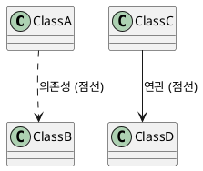

# PlantUML문법검사가이드

## 개요

PlantUML 다이어그램의 문법 오류를 사전에 검출하여 렌더링 실패를 방지하기 위한 가이드입니다. Docker 기반 PlantUML 서버를 활용하여 로컬에서 빠르게 문법을 검증할 수 있습니다.

## PlantUML 서버 설치 검사

### Docker로 PlantUML 서버 실행

```bash
# PlantUML 서버가 실행 중인지 확인
docker ps | grep plantuml

# PlantUML 서버가 없으면 설치 및 실행
docker run -d --name plantuml -p 38080:8080 plantuml/plantuml-server:latest

# 서버 상태 확인
docker logs plantuml
```

## 문법 검사 방법
현재 OS에 맞게 수행.

### Linux/macOS 버전

1. tools/check-plantuml.sh 파일 존재 여부 확인 
2. 스크립트 파일이 없으면 "PlantUML문법검사기(Linux/Mac)"를 tools/check-plantuml.sh 파일로 다운로드하여 스크립트 파일을 만듦
3. 스크립트 파일이 있으면 그 스크립트 파일을 이용하여 검사

### Windows PowerShell 버전
**스크립트 파일(tools/check-plantuml.ps1)을 이용하여 수행**.

1. tools/check-plantuml.ps1 파일 존재 여부 확인 
2. 스크립트 파일이 없으면 "PlantUML문법검사기(Window)"를 tools/check-plantuml.ps1 파일로 다운로드하여 스크립트 파일을 만듦
3. 스크립트 파일이 있으면 그 스크립트 파일을 이용하여 검사
 
### 검사 결과 해석

| 출력 | 의미 | 대응 방법 |
|------|------|-----------|
| 출력 없음 | 문법 오류 없음 ✅ | 정상, 렌더링 가능 |
| "Some diagram description contains errors" | 오류 존재 ❌ | 파이프 방식으로 상세 확인 |
| "ERROR" + 라인 번호 | 특정 라인 오류 ❌ | 해당 라인 수정 |
| "Error line X in file" | X번째 줄 오류 ❌ | 해당 라인 문법 확인 |

## 화살표 문법 규칙

### 시퀀스 다이어그램 올바른 화살표 사용법

```plantuml
@startuml
' 올바른 사용법 ✅
A -> B: 동기 메시지 (실선)
A ->> B: 비동기 메시지 (실선, 열린 화살촉)
A -->> B: 비동기 응답 (점선, 열린 화살촉)  
A --> B: 점선 화살표 (일반)
A <-- B: 응답 (점선)
A ->x B: 실패/거부 (X 표시)
A ->>o B: 비동기 열린 원

' 잘못된 사용법 ❌
A ..> B: ' 오류! sequence diagram에서 유효하지 않음
@enduml
```

### 클래스 다이어그램 화살표



### 화살표 문법 주의사항

1. **`..>`는 sequence diagram에서 사용 금지**
2. 비동기 메시지는 `->>` 또는 `-->>` 사용
3. 동기/비동기를 명확히 구분하여 일관되게 사용
4. 다이어그램 타입별로 유효한 화살표가 다름